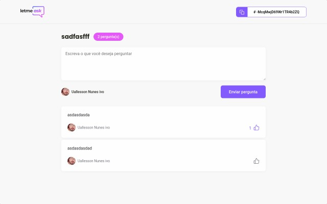
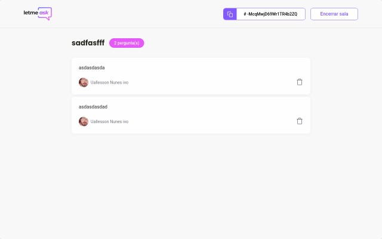

<p align="center">
    Project developed during NLW6, an event organized by @Rocketseat. Instructed by @diego3g.
</p>

<h1 align="center">
  Letmeask
  <br>
</h1>

<h4 align="center">Site de salas Q&A ao-vivo</h4>

<p align="center">
  
  
  
  
</p>

## How to use

```bash
# Clone this repository
$ git clone https://github.com/Uallessonivo/letmeask

# Go into the repository
$ cd dashgo

# Install dependencies
$ yarn

# Run the app
$ yarn start
```


## License

MIT

---
