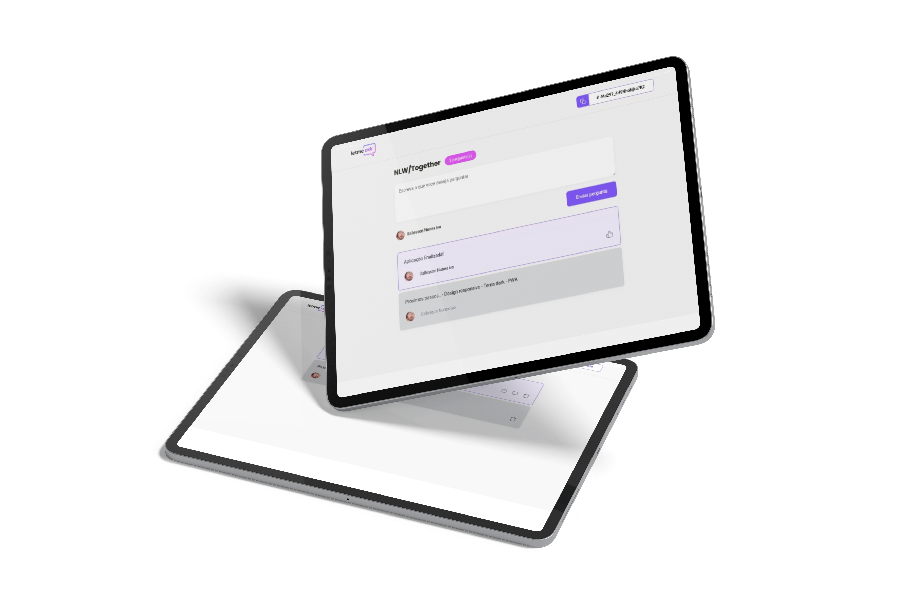

<h1 align="center">
  Letmeask
  <br>
</h1>

<h4 align="center">Site de salas Q&A ao-vivo</h4>

<p align="center">
  <a href="#stack">Stack</a> •
  <a href="#features">Features</a> •
  <a href="#how-to-use">How to use</a> •
</p>

<p align="center">
  
</p>

## STACK

- Typescript
- React js
- Firebase

<p align="center">
  
  
</p>

## Features

- Conversas em tempo real
- Highlight da pergunta
- Marcar perguntar como respondida
- Deletar pergunta

## Desgin responsivo em progresso

<p align="center">
  
</p>

## How to use

```bash
# Clone this repository
$ git clone https://github.com/Uallessonivo/letmeask

# Go into the repository
$ cd letmeask

# Install dependencies
$ yarn

# Run the app
$ yarn start
```

## License

MIT

---
